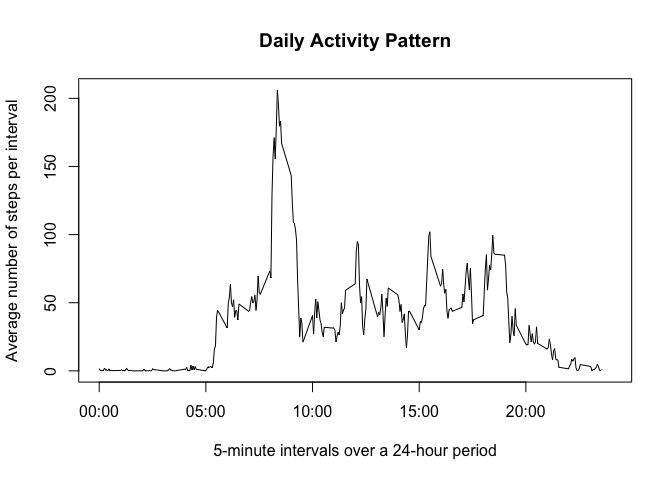
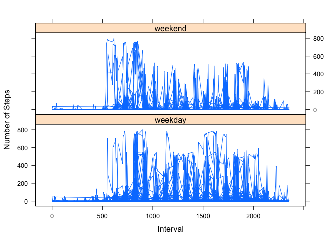

# Reproducible Research: Peer Assessment 1
## Load environment
Load the packages required.

```r
library(data.table, quietly="TRUE")
```

```
## 
## Attaching package: 'data.table'
## 
## The following object is masked _by_ '.GlobalEnv':
## 
##     .N
```

```r
library(dplyr, quietly="TRUE")
```

```
## 
## Attaching package: 'dplyr'
## 
## The following objects are masked from 'package:data.table':
## 
##     between, last
## 
## The following objects are masked from 'package:stats':
## 
##     filter, lag
## 
## The following objects are masked from 'package:base':
## 
##     intersect, setdiff, setequal, union
```

```r
library(knitr, quietly="TRUE")
library(lubridate, quietly="TRUE")
```

```
## 
## Attaching package: 'lubridate'
## 
## The following objects are masked from 'package:data.table':
## 
##     hour, mday, month, quarter, wday, week, yday, year
```

```r
library(lattice, quietly="TRUE")
```

### Report session environment

```r
sessionInfo()
```

```
## R version 3.2.0 (2015-04-16)
## Platform: x86_64-apple-darwin13.4.0 (64-bit)
## Running under: OS X 10.10 (Yosemite)
## 
## locale:
## [1] en_US.UTF-8/en_US.UTF-8/en_US.UTF-8/C/en_US.UTF-8/en_US.UTF-8
## 
## attached base packages:
## [1] stats     graphics  grDevices utils     datasets  methods   base     
## 
## other attached packages:
## [1] lattice_0.20-33  lubridate_1.3.3  knitr_1.10.5     dplyr_0.4.2     
## [5] data.table_1.9.4
## 
## loaded via a namespace (and not attached):
##  [1] Rcpp_0.11.6     assertthat_0.1  digest_0.6.8    grid_3.2.0     
##  [5] R6_2.0.1        chron_2.3-45    plyr_1.8.2      DBI_0.3.1      
##  [9] formatR_1.2     magrittr_1.5    evaluate_0.7    stringi_0.4-1  
## [13] reshape2_1.4.1  rmarkdown_0.6.1 tools_3.2.0     stringr_1.0.0  
## [17] parallel_3.2.0  yaml_2.1.13     memoise_0.2.1   htmltools_0.2.6
```

## Loading and preprocessing the data

### Download
Download the data.
I forked a github project via RStudio but the data can be downloaded programmatically from the following URL:
https://d396qusza40orc.cloudfront.net/repdata%2Fdata%2Factivity.zip


```r
setwd("~/WorkDirDataScience/RepData_PeerAssessment1")
if(!file.exists("activity.zip")){
  fileUrl <- "https://d396qusza40orc.cloudfront.net/repdata%2Fdata%2Factivity.zip"
  download.file(fileUrl,destfile="activity.zip",method="curl")
  dateDownloaded <- date()
  }else{  
  dateDownloaded <- file.info("activity.csv")$ctime
  }
print(paste("Date downloaded:", dateDownloaded, sep = " "))
```

```
## [1] "Date downloaded: 2015-08-15 11:41:17"
```


### Unzip
Sometimes on my machine, zip files automatically unzip after downloading.  
Check for that before unzipping the data.

```r
if(!file.exists("activity.csv")) {unzip("activity.zip")}
```

### Import

```r
rawdata <- read.csv("activity.csv")
```

### Examine

```r
summary(rawdata) #Eyeball the data.
```

```
##      steps                date          interval     
##  Min.   :  0.00   2012-10-01:  288   Min.   :   0.0  
##  1st Qu.:  0.00   2012-10-02:  288   1st Qu.: 588.8  
##  Median :  0.00   2012-10-03:  288   Median :1177.5  
##  Mean   : 37.38   2012-10-04:  288   Mean   :1177.5  
##  3rd Qu.: 12.00   2012-10-05:  288   3rd Qu.:1766.2  
##  Max.   :806.00   2012-10-06:  288   Max.   :2355.0  
##  NA's   :2304     (Other)   :15840
```

```r
length(table(rawdata$date)) #Check the number of dates.
```

```
## [1] 61
```

```r
unique(rawdata$date) #Check the range of dates.
```

```
##  [1] 2012-10-01 2012-10-02 2012-10-03 2012-10-04 2012-10-05 2012-10-06
##  [7] 2012-10-07 2012-10-08 2012-10-09 2012-10-10 2012-10-11 2012-10-12
## [13] 2012-10-13 2012-10-14 2012-10-15 2012-10-16 2012-10-17 2012-10-18
## [19] 2012-10-19 2012-10-20 2012-10-21 2012-10-22 2012-10-23 2012-10-24
## [25] 2012-10-25 2012-10-26 2012-10-27 2012-10-28 2012-10-29 2012-10-30
## [31] 2012-10-31 2012-11-01 2012-11-02 2012-11-03 2012-11-04 2012-11-05
## [37] 2012-11-06 2012-11-07 2012-11-08 2012-11-09 2012-11-10 2012-11-11
## [43] 2012-11-12 2012-11-13 2012-11-14 2012-11-15 2012-11-16 2012-11-17
## [49] 2012-11-18 2012-11-19 2012-11-20 2012-11-21 2012-11-22 2012-11-23
## [55] 2012-11-24 2012-11-25 2012-11-26 2012-11-27 2012-11-28 2012-11-29
## [61] 2012-11-30
## 61 Levels: 2012-10-01 2012-10-02 2012-10-03 2012-10-04 ... 2012-11-30
```

```r
table(is.na(rawdata$steps)) #Check number of NAs in steps.
```

```
## 
## FALSE  TRUE 
## 15264  2304
```
The data is comprised of 17568 observations of three variables:  
- steps: The max number of steps for any 5-minute interval is 806; the mean of all the intervals is 37.38 steps.    
- date: The period of observation spans 61 days from October 1, 2012 to November 30, 2012; however, only 53 have data.  
The remaining 8 days are populated with NA values; NA values exist only in these 8 days.  
- interval: An observation is taken at 5 minute intervals. For each of the 61 days, there are 288 observations (12x24). 
 
### Clean
My personal preference is to convert data frames to data tables.

#### Create data table.


```r
dtdata <- data.table(rawdata)
dtdata
```

```
##        steps       date interval
##     1:    NA 2012-10-01        0
##     2:    NA 2012-10-01        5
##     3:    NA 2012-10-01       10
##     4:    NA 2012-10-01       15
##     5:    NA 2012-10-01       20
##    ---                          
## 17564:    NA 2012-11-30     2335
## 17565:    NA 2012-11-30     2340
## 17566:    NA 2012-11-30     2345
## 17567:    NA 2012-11-30     2350
## 17568:    NA 2012-11-30     2355
```


## What is mean total number of steps taken per day?
For this part of the assignment, you can ignore the missing values in
the dataset.

1. Make a histogram of the total number of steps taken each day.  
2. Calculate and report the **mean** and **median** total number of steps taken per day.  

### Calculate sum, mean, and median by date.
For each date, calculate the total number of steps taken. There should be 61 sums with 8 NAs. 
For each date, calculate the average number of steps taken. This is the average of the 288 observations for each day, so it is actually the average number of steps in any 5-minute period. 
For each date, calculate the midpoint of the 288 observations. If you do a table of the values, it shows that there 11014 out of the 17568 observations showed zero steps. That's why the median for any given day is zero.


```r
calcsfordate <- summarize(group_by(dtdata,date),
                         totalfordate = sum(steps),
                         averagefordate = mean(steps),
                         medianfordate = as.double(median(steps, na.rm=TRUE))
                         )
```

### Examine the data aggregated by interval.

```r
summary(calcsforinterval)
```

```
##     interval      totalforinterval  averageforinterval medianforinterval
##  Min.   :   0.0   Min.   :    0.0   Min.   :  0.000    Min.   : 0.000   
##  1st Qu.: 588.8   1st Qu.:  131.8   1st Qu.:  2.486    1st Qu.: 0.000   
##  Median :1177.5   Median : 1808.0   Median : 34.113    Median : 0.000   
##  Mean   :1177.5   Mean   : 1981.3   Mean   : 37.383    Mean   : 3.962   
##  3rd Qu.:1766.2   3rd Qu.: 2800.2   3rd Qu.: 52.835    3rd Qu.: 0.000   
##  Max.   :2355.0   Max.   :10927.0   Max.   :206.170    Max.   :60.000
```

```r
kable(calcsforinterval) #288 5-minute intervals in a 24-hour day
```


 interval   totalforinterval   averageforinterval   medianforinterval
---------  -----------------  -------------------  ------------------
        0                 91            1.7169811                   0
        5                 18            0.3396226                   0
       10                  7            0.1320755                   0
       15                  8            0.1509434                   0
       20                  4            0.0754717                   0
       25                111            2.0943396                   0
       30                 28            0.5283019                   0
       35                 46            0.8679245                   0
       40                  0            0.0000000                   0
       45                 78            1.4716981                   0
       50                 16            0.3018868                   0
       55                  7            0.1320755                   0
      100                 17            0.3207547                   0
      105                 36            0.6792453                   0
      110                  8            0.1509434                   0
      115                 18            0.3396226                   0
      120                  0            0.0000000                   0
      125                 59            1.1132075                   0
      130                 97            1.8301887                   0
      135                  9            0.1698113                   0
      140                  9            0.1698113                   0
      145                 20            0.3773585                   0
      150                 14            0.2641509                   0
      155                  0            0.0000000                   0
      200                  0            0.0000000                   0
      205                  0            0.0000000                   0
      210                 60            1.1320755                   0
      215                  0            0.0000000                   0
      220                  0            0.0000000                   0
      225                  7            0.1320755                   0
      230                  0            0.0000000                   0
      235                 12            0.2264151                   0
      240                  0            0.0000000                   0
      245                  0            0.0000000                   0
      250                 82            1.5471698                   0
      255                 50            0.9433962                   0
      300                  0            0.0000000                   0
      305                  0            0.0000000                   0
      310                  0            0.0000000                   0
      315                  0            0.0000000                   0
      320                 11            0.2075472                   0
      325                 33            0.6226415                   0
      330                 86            1.6226415                   0
      335                 31            0.5849057                   0
      340                 26            0.4905660                   0
      345                  4            0.0754717                   0
      350                  0            0.0000000                   0
      355                  0            0.0000000                   0
      400                 63            1.1886792                   0
      405                 50            0.9433962                   0
      410                136            2.5660377                   0
      415                  0            0.0000000                   0
      420                 18            0.3396226                   0
      425                 19            0.3584906                   0
      430                218            4.1132075                   0
      435                 35            0.6603774                   0
      440                185            3.4905660                   0
      445                 44            0.8301887                   0
      450                165            3.1132075                   0
      455                 59            1.1132075                   0
      500                  0            0.0000000                   0
      505                 83            1.5660377                   0
      510                159            3.0000000                   0
      515                119            2.2452830                   0
      520                176            3.3207547                   0
      525                157            2.9622642                   0
      530                111            2.0943396                   0
      535                321            6.0566038                   0
      540                849           16.0188679                   0
      545                972           18.3396226                   0
      550               2091           39.4528302                   0
      555               2358           44.4905660                   0
      600               1669           31.4905660                   0
      605               2611           49.2641509                   0
      610               2850           53.7735849                   0
      615               3363           63.4528302                   0
      620               2648           49.9622642                   0
      625               2495           47.0754717                   0
      630               2764           52.1509434                   0
      635               2085           39.3396226                   0
      640               2333           44.0188679                   0
      645               2341           44.1698113                   0
      650               1980           37.3584906                   8
      655               2599           49.0377358                  13
      700               2322           43.8113208                   7
      705               2352           44.3773585                  13
      710               2677           50.5094340                  14
      715               2889           54.5094340                   0
      720               2646           49.9245283                   0
      725               2702           50.9811321                  12
      730               2951           55.6792453                   0
      735               2349           44.3207547                   0
      740               2770           52.2641509                  15
      745               3686           69.5471698                  19
      750               3066           57.8490566                  19
      755               2976           56.1509434                  28
      800               3889           73.3773585                  41
      805               3615           68.2075472                  25
      810               6860          129.4339623                  32
      815               8349          157.5283019                  13
      820               9071          171.1509434                  45
      825               8236          155.3962264                  33
      830               9397          177.3018868                  37
      835              10927          206.1698113                  19
      840              10384          195.9245283                  51
      845               9517          179.5660377                  60
      850               9720          183.3962264                  16
      855               8852          167.0188679                  43
      900               7603          143.4528302                  20
      905               6574          124.0377358                   8
      910               5783          109.1132075                  31
      915               5730          108.1132075                  15
      920               5497          103.7169811                  16
      925               5086           95.9622642                   0
      930               3509           66.2075472                   0
      935               2397           45.2264151                   0
      940               1314           24.7924528                   0
      945               2054           38.7547170                   0
      950               1854           34.9811321                   0
      955               1116           21.0566038                   0
     1000               2150           40.5660377                   0
     1005               1430           26.9811321                   0
     1010               2248           42.4150943                   0
     1015               2791           52.6603774                   0
     1020               2063           38.9245283                   0
     1025               2692           50.7924528                   0
     1030               2347           44.2830189                   0
     1035               1983           37.4150943                   0
     1040               1839           34.6981132                   0
     1045               1502           28.3396226                   0
     1050               1330           25.0943396                   0
     1055               1693           31.9433962                   0
     1100               1662           31.3584906                   0
     1105               1573           29.6792453                   0
     1110               1130           21.3207547                   0
     1115               1354           25.5471698                   0
     1120               1504           28.3773585                   0
     1125               1403           26.4716981                   0
     1130               1772           33.4339623                   0
     1135               2649           49.9811321                   0
     1140               2228           42.0377358                   0
     1145               2364           44.6037736                   0
     1150               2440           46.0377358                   0
     1155               3137           59.1886792                   0
     1200               3385           63.8679245                   0
     1205               4648           87.6981132                   0
     1210               5027           94.8490566                   6
     1215               4917           92.7735849                  10
     1220               3360           63.3962264                   0
     1225               2659           50.1698113                   0
     1230               2887           54.4716981                   0
     1235               1718           32.4150943                   0
     1240               1406           26.5283019                   0
     1245               2000           37.7358491                   0
     1250               2388           45.0566038                   0
     1255               3566           67.2830189                   0
     1300               2244           42.3396226                   0
     1305               2114           39.8867925                   0
     1310               2293           43.2641509                   0
     1315               2172           40.9811321                   0
     1320               2451           46.2452830                   0
     1325               2991           56.4339623                   0
     1330               2266           42.7547170                   0
     1335               1332           25.1320755                   0
     1340               2118           39.9622642                   0
     1345               2838           53.5471698                   0
     1350               2508           47.3207547                   0
     1355               3223           60.8113208                   0
     1400               2955           55.7547170                   0
     1405               2754           51.9622642                   0
     1410               2310           43.5849057                   0
     1415               2581           48.6981132                   0
     1420               1880           35.4716981                   0
     1425               1990           37.5471698                   0
     1430               2218           41.8490566                   0
     1435               1458           27.5094340                   0
     1440                907           17.1132075                   0
     1445               1382           26.0754717                   0
     1450               2312           43.6226415                   0
     1455               2320           43.7735849                   0
     1500               1591           30.0188679                   0
     1505               1912           36.0754717                   0
     1510               1881           35.4905660                   0
     1515               2059           38.8490566                   0
     1520               2436           45.9622642                   0
     1525               2531           47.7547170                   0
     1530               2551           48.1320755                   0
     1535               3462           65.3207547                   0
     1540               4394           82.9056604                   0
     1545               5229           98.6603774                   0
     1550               5412          102.1132075                   0
     1555               4450           83.9622642                   0
     1600               3293           62.1320755                   0
     1605               3399           64.1320755                   0
     1610               3951           74.5471698                   0
     1615               3348           63.1698113                   0
     1620               3016           56.9056604                   0
     1625               3168           59.7735849                   0
     1630               2325           43.8679245                   0
     1635               2044           38.5660377                   0
     1640               2367           44.6603774                   0
     1645               2409           45.4528302                   0
     1650               2449           46.2075472                   0
     1655               2315           43.6792453                   0
     1700               2471           46.6226415                   0
     1705               2984           56.3018868                   0
     1710               2688           50.7169811                   0
     1715               3245           61.2264151                   7
     1720               3854           72.7169811                   7
     1725               4184           78.9433962                   0
     1730               3654           68.9433962                   7
     1735               3162           59.6603774                   7
     1740               3980           75.0943396                  26
     1745               2995           56.5094340                   7
     1750               1843           34.7735849                   0
     1755               1985           37.4528302                  10
     1800               2156           40.6792453                  15
     1805               3075           58.0188679                  18
     1810               3959           74.6981132                  26
     1815               4522           85.3207547                  25
     1820               3141           59.2641509                  24
     1825               3592           67.7735849                   9
     1830               4118           77.6981132                  33
     1835               3935           74.2452830                  26
     1840               4523           85.3396226                  34
     1845               5271           99.4528302                  42
     1850               4589           86.5849057                  33
     1855               4537           85.6037736                  30
     1900               4498           84.8679245                  33
     1905               4125           77.8301887                  30
     1910               3076           58.0377358                   8
     1915               2828           53.3584906                   8
     1920               1925           36.3207547                   7
     1925               1098           20.7169811                   0
     1930               1452           27.3962264                   0
     1935               2121           40.0188679                   0
     1940               1601           30.2075472                   0
     1945               1354           25.5471698                   0
     1950               2420           45.6603774                   0
     1955               1777           33.5283019                   0
     2000               1040           19.6226415                   0
     2005               1008           19.0188679                   0
     2010               1025           19.3396226                   0
     2015               1767           33.3396226                   0
     2020               1421           26.8113208                   0
     2025               1122           21.1698113                   0
     2030               1447           27.3018868                   0
     2035               1131           21.3396226                   0
     2040               1036           19.5471698                   0
     2045               1130           21.3207547                   0
     2050               1712           32.3018868                   0
     2055               1068           20.1509434                   0
     2100                845           15.9433962                   0
     2105                913           17.2264151                   0
     2110               1243           23.4528302                   0
     2115               1020           19.2452830                   0
     2120                660           12.4528302                   0
     2125                425            8.0188679                   0
     2130                777           14.6603774                   0
     2135                864           16.3018868                   0
     2140                460            8.6792453                   0
     2145                413            7.7924528                   0
     2150                431            8.1320755                   0
     2155                139            2.6226415                   0
     2200                 77            1.4528302                   0
     2205                195            3.6792453                   0
     2210                255            4.8113208                   0
     2215                451            8.5094340                   0
     2220                375            7.0754717                   0
     2225                461            8.6981132                   0
     2230                517            9.7547170                   0
     2235                117            2.2075472                   0
     2240                 17            0.3207547                   0
     2245                  6            0.1132075                   0
     2250                 85            1.6037736                   0
     2255                244            4.6037736                   0
     2300                175            3.3018868                   0
     2305                151            2.8490566                   0
     2310                  0            0.0000000                   0
     2315                 44            0.8301887                   0
     2320                 51            0.9622642                   0
     2325                 84            1.5849057                   0
     2330                138            2.6037736                   0
     2335                249            4.6981132                   0
     2340                175            3.3018868                   0
     2345                 34            0.6415094                   0
     2350                 12            0.2264151                   0
     2355                 57            1.0754717                   0

```r
table(calcsforinterval$totalforinterval)
```

```
## 
##     0     4     6     7     8     9    11    12    14    16    17    18 
##    19     2     1     3     2     2     1     2     1     1     2     3 
##    19    20    26    28    31    33    34    35    36    44    46    50 
##     1     1     1     1     1     1     1     1     1     2     1     2 
##    51    57    59    60    63    77    78    82    83    84    85    86 
##     1     1     2     1     1     1     1     1     1     1     1     1 
##    91    97   111   117   119   136   138   139   151   157   159   165 
##     1     1     2     1     1     1     1     1     1     1     1     1 
##   175   176   185   195   218   244   249   255   321   375   413   425 
##     2     1     1     1     1     1     1     1     1     1     1     1 
##   431   451   460   461   517   660   777   845   849   864   907   913 
##     1     1     1     1     1     1     1     1     1     1     1     1 
##   972  1008  1020  1025  1036  1040  1068  1098  1116  1122  1130  1131 
##     1     1     1     1     1     1     1     1     1     1     2     1 
##  1243  1314  1330  1332  1354  1382  1403  1406  1421  1430  1447  1452 
##     1     1     1     1     2     1     1     1     1     1     1     1 
##  1458  1502  1504  1573  1591  1601  1662  1669  1693  1712  1718  1767 
##     1     1     1     1     1     1     1     1     1     1     1     1 
##  1772  1777  1839  1843  1854  1880  1881  1912  1925  1980  1983  1985 
##     1     1     1     1     1     1     1     1     1     1     1     1 
##  1990  2000  2044  2054  2059  2063  2085  2091  2114  2118  2121  2150 
##     1     1     1     1     1     1     1     1     1     1     1     1 
##  2156  2172  2218  2228  2244  2248  2266  2293  2310  2312  2315  2320 
##     1     1     1     1     1     1     1     1     1     1     1     1 
##  2322  2325  2333  2341  2347  2349  2352  2358  2364  2367  2388  2397 
##     1     1     1     1     1     1     1     1     1     1     1     1 
##  2409  2420  2436  2440  2449  2451  2471  2495  2508  2531  2551  2581 
##     1     1     1     1     1     1     1     1     1     1     1     1 
##  2599  2611  2646  2648  2649  2659  2677  2688  2692  2702  2754  2764 
##     1     1     1     1     1     1     1     1     1     1     1     1 
##  2770  2791  2828  2838  2850  2887  2889  2951  2955  2976  2984  2991 
##     1     1     1     1     1     1     1     1     1     1     1     1 
##  2995  3016  3066  3075  3076  3137  3141  3162  3168  3223  3245  3293 
##     1     1     1     1     1     1     1     1     1     1     1     1 
##  3348  3360  3363  3385  3399  3462  3509  3566  3592  3615  3654  3686 
##     1     1     1     1     1     1     1     1     1     1     1     1 
##  3854  3889  3935  3951  3959  3980  4118  4125  4184  4394  4450  4498 
##     1     1     1     1     1     1     1     1     1     1     1     1 
##  4522  4523  4537  4589  4648  4917  5027  5086  5229  5271  5412  5497 
##     1     1     1     1     1     1     1     1     1     1     1     1 
##  5730  5783  6574  6860  7603  8236  8349  8852  9071  9397  9517  9720 
##     1     1     1     1     1     1     1     1     1     1     1     1 
## 10384 10927 
##     1     1
```
Note: The NA values are in entire days. So those days are NA.

### Check math logic. 

```r
sum(dtdata$steps[which(dtdata$date=="2012-10-04")]) #Should be 12116
```

```
## [1] 12116
```

```r
mean(dtdata$steps[which(dtdata$date=="2012-10-04")]) #Should be 42.0694444
```

```
## [1] 42.06944
```


### Graph the total number of steps taken.
1. Make a histogram of the total number of steps taken each day.  
 
The challenge to any histogram is deciding what a meaningful number of breakpoints should be. 
The average total number of steps per day ranges from 41 to 21194, so I went with groups of 2000 steps. 
More than that results in too many empty "bins" in the histogram.


```r
hist(calcsfordate$totalfordate, breaks=10, main="Spread of average number of steps each day", xlab="Average number of steps a day range from 41 to 21194", ylab="Number of observations in each range")
```

 

### Report the mean and median number of steps taken each day.
2. Calculate and report the **mean** and **median** total number of steps taken per day.
After ignoring the NAs, 53 sums were calculated ranging from 41 steps in a day to 21194 steps in a day.
- Mean of daily totals: 10766.19 
- Median of daily total: 10765

### Examine the data aggregated by date.

```r
paste("Fewest number of total steps in a day:", min(calcsfordate$totalfordate, na.rm=TRUE), sep=" ")
```

```
## [1] "Fewest number of total steps in a day: 41"
```

```r
paste("Greatest number of total steps in a day:", max(calcsfordate$totalfordate, na.rm=TRUE), sep=" ")
```

```
## [1] "Greatest number of total steps in a day: 21194"
```

```r
paste("Average number of total steps by day:", mean(calcsfordate$totalfordate, na.rm=TRUE), sep=" ")
```

```
## [1] "Average number of total steps by day: 10766.1886792453"
```

```r
paste("Midpoint of total steps by day:",as.double(median(calcsfordate$totalfordate, na.rm=TRUE)), sep=" ")
```

```
## [1] "Midpoint of total steps by day: 10765"
```


## What is the average daily activity pattern?
1. Make a time series plot (i.e. `type = "l"`) of the 5-minute interval (x-axis) and the average number of steps taken, averaged across all days (y-axis)
2. Which 5-minute interval, on average across all the days in the dataset, contains the maximum number of steps?

### Calculate sum, mean, and median by interval.
Next we are slicing the data across: aggregating the number of steps for any given time interval, such as 08:30, for all 53 days with data.  
When aggregating data for the intervals, remove NAs since every interval has eight instances of NAs.

```r
calcsforinterval <- summarize(group_by(dtdata,interval),
                             totalforinterval = sum(steps, na.rm=TRUE),
                             averageforinterval = mean(steps, na.rm=TRUE),
                             medianforinterval = as.double(median(steps, na.rm=TRUE))
                             )
```

### Examine the data aggregated by interval.

```r
summary(calcsforinterval)
```

```
##     interval      totalforinterval  averageforinterval medianforinterval
##  Min.   :   0.0   Min.   :    0.0   Min.   :  0.000    Min.   : 0.000   
##  1st Qu.: 588.8   1st Qu.:  131.8   1st Qu.:  2.486    1st Qu.: 0.000   
##  Median :1177.5   Median : 1808.0   Median : 34.113    Median : 0.000   
##  Mean   :1177.5   Mean   : 1981.3   Mean   : 37.383    Mean   : 3.962   
##  3rd Qu.:1766.2   3rd Qu.: 2800.2   3rd Qu.: 52.835    3rd Qu.: 0.000   
##  Max.   :2355.0   Max.   :10927.0   Max.   :206.170    Max.   :60.000
```

```r
kable(calcsforinterval) #288 5-minute intervals in a 24-hour day
```


 interval   totalforinterval   averageforinterval   medianforinterval
---------  -----------------  -------------------  ------------------
        0                 91            1.7169811                   0
        5                 18            0.3396226                   0
       10                  7            0.1320755                   0
       15                  8            0.1509434                   0
       20                  4            0.0754717                   0
       25                111            2.0943396                   0
       30                 28            0.5283019                   0
       35                 46            0.8679245                   0
       40                  0            0.0000000                   0
       45                 78            1.4716981                   0
       50                 16            0.3018868                   0
       55                  7            0.1320755                   0
      100                 17            0.3207547                   0
      105                 36            0.6792453                   0
      110                  8            0.1509434                   0
      115                 18            0.3396226                   0
      120                  0            0.0000000                   0
      125                 59            1.1132075                   0
      130                 97            1.8301887                   0
      135                  9            0.1698113                   0
      140                  9            0.1698113                   0
      145                 20            0.3773585                   0
      150                 14            0.2641509                   0
      155                  0            0.0000000                   0
      200                  0            0.0000000                   0
      205                  0            0.0000000                   0
      210                 60            1.1320755                   0
      215                  0            0.0000000                   0
      220                  0            0.0000000                   0
      225                  7            0.1320755                   0
      230                  0            0.0000000                   0
      235                 12            0.2264151                   0
      240                  0            0.0000000                   0
      245                  0            0.0000000                   0
      250                 82            1.5471698                   0
      255                 50            0.9433962                   0
      300                  0            0.0000000                   0
      305                  0            0.0000000                   0
      310                  0            0.0000000                   0
      315                  0            0.0000000                   0
      320                 11            0.2075472                   0
      325                 33            0.6226415                   0
      330                 86            1.6226415                   0
      335                 31            0.5849057                   0
      340                 26            0.4905660                   0
      345                  4            0.0754717                   0
      350                  0            0.0000000                   0
      355                  0            0.0000000                   0
      400                 63            1.1886792                   0
      405                 50            0.9433962                   0
      410                136            2.5660377                   0
      415                  0            0.0000000                   0
      420                 18            0.3396226                   0
      425                 19            0.3584906                   0
      430                218            4.1132075                   0
      435                 35            0.6603774                   0
      440                185            3.4905660                   0
      445                 44            0.8301887                   0
      450                165            3.1132075                   0
      455                 59            1.1132075                   0
      500                  0            0.0000000                   0
      505                 83            1.5660377                   0
      510                159            3.0000000                   0
      515                119            2.2452830                   0
      520                176            3.3207547                   0
      525                157            2.9622642                   0
      530                111            2.0943396                   0
      535                321            6.0566038                   0
      540                849           16.0188679                   0
      545                972           18.3396226                   0
      550               2091           39.4528302                   0
      555               2358           44.4905660                   0
      600               1669           31.4905660                   0
      605               2611           49.2641509                   0
      610               2850           53.7735849                   0
      615               3363           63.4528302                   0
      620               2648           49.9622642                   0
      625               2495           47.0754717                   0
      630               2764           52.1509434                   0
      635               2085           39.3396226                   0
      640               2333           44.0188679                   0
      645               2341           44.1698113                   0
      650               1980           37.3584906                   8
      655               2599           49.0377358                  13
      700               2322           43.8113208                   7
      705               2352           44.3773585                  13
      710               2677           50.5094340                  14
      715               2889           54.5094340                   0
      720               2646           49.9245283                   0
      725               2702           50.9811321                  12
      730               2951           55.6792453                   0
      735               2349           44.3207547                   0
      740               2770           52.2641509                  15
      745               3686           69.5471698                  19
      750               3066           57.8490566                  19
      755               2976           56.1509434                  28
      800               3889           73.3773585                  41
      805               3615           68.2075472                  25
      810               6860          129.4339623                  32
      815               8349          157.5283019                  13
      820               9071          171.1509434                  45
      825               8236          155.3962264                  33
      830               9397          177.3018868                  37
      835              10927          206.1698113                  19
      840              10384          195.9245283                  51
      845               9517          179.5660377                  60
      850               9720          183.3962264                  16
      855               8852          167.0188679                  43
      900               7603          143.4528302                  20
      905               6574          124.0377358                   8
      910               5783          109.1132075                  31
      915               5730          108.1132075                  15
      920               5497          103.7169811                  16
      925               5086           95.9622642                   0
      930               3509           66.2075472                   0
      935               2397           45.2264151                   0
      940               1314           24.7924528                   0
      945               2054           38.7547170                   0
      950               1854           34.9811321                   0
      955               1116           21.0566038                   0
     1000               2150           40.5660377                   0
     1005               1430           26.9811321                   0
     1010               2248           42.4150943                   0
     1015               2791           52.6603774                   0
     1020               2063           38.9245283                   0
     1025               2692           50.7924528                   0
     1030               2347           44.2830189                   0
     1035               1983           37.4150943                   0
     1040               1839           34.6981132                   0
     1045               1502           28.3396226                   0
     1050               1330           25.0943396                   0
     1055               1693           31.9433962                   0
     1100               1662           31.3584906                   0
     1105               1573           29.6792453                   0
     1110               1130           21.3207547                   0
     1115               1354           25.5471698                   0
     1120               1504           28.3773585                   0
     1125               1403           26.4716981                   0
     1130               1772           33.4339623                   0
     1135               2649           49.9811321                   0
     1140               2228           42.0377358                   0
     1145               2364           44.6037736                   0
     1150               2440           46.0377358                   0
     1155               3137           59.1886792                   0
     1200               3385           63.8679245                   0
     1205               4648           87.6981132                   0
     1210               5027           94.8490566                   6
     1215               4917           92.7735849                  10
     1220               3360           63.3962264                   0
     1225               2659           50.1698113                   0
     1230               2887           54.4716981                   0
     1235               1718           32.4150943                   0
     1240               1406           26.5283019                   0
     1245               2000           37.7358491                   0
     1250               2388           45.0566038                   0
     1255               3566           67.2830189                   0
     1300               2244           42.3396226                   0
     1305               2114           39.8867925                   0
     1310               2293           43.2641509                   0
     1315               2172           40.9811321                   0
     1320               2451           46.2452830                   0
     1325               2991           56.4339623                   0
     1330               2266           42.7547170                   0
     1335               1332           25.1320755                   0
     1340               2118           39.9622642                   0
     1345               2838           53.5471698                   0
     1350               2508           47.3207547                   0
     1355               3223           60.8113208                   0
     1400               2955           55.7547170                   0
     1405               2754           51.9622642                   0
     1410               2310           43.5849057                   0
     1415               2581           48.6981132                   0
     1420               1880           35.4716981                   0
     1425               1990           37.5471698                   0
     1430               2218           41.8490566                   0
     1435               1458           27.5094340                   0
     1440                907           17.1132075                   0
     1445               1382           26.0754717                   0
     1450               2312           43.6226415                   0
     1455               2320           43.7735849                   0
     1500               1591           30.0188679                   0
     1505               1912           36.0754717                   0
     1510               1881           35.4905660                   0
     1515               2059           38.8490566                   0
     1520               2436           45.9622642                   0
     1525               2531           47.7547170                   0
     1530               2551           48.1320755                   0
     1535               3462           65.3207547                   0
     1540               4394           82.9056604                   0
     1545               5229           98.6603774                   0
     1550               5412          102.1132075                   0
     1555               4450           83.9622642                   0
     1600               3293           62.1320755                   0
     1605               3399           64.1320755                   0
     1610               3951           74.5471698                   0
     1615               3348           63.1698113                   0
     1620               3016           56.9056604                   0
     1625               3168           59.7735849                   0
     1630               2325           43.8679245                   0
     1635               2044           38.5660377                   0
     1640               2367           44.6603774                   0
     1645               2409           45.4528302                   0
     1650               2449           46.2075472                   0
     1655               2315           43.6792453                   0
     1700               2471           46.6226415                   0
     1705               2984           56.3018868                   0
     1710               2688           50.7169811                   0
     1715               3245           61.2264151                   7
     1720               3854           72.7169811                   7
     1725               4184           78.9433962                   0
     1730               3654           68.9433962                   7
     1735               3162           59.6603774                   7
     1740               3980           75.0943396                  26
     1745               2995           56.5094340                   7
     1750               1843           34.7735849                   0
     1755               1985           37.4528302                  10
     1800               2156           40.6792453                  15
     1805               3075           58.0188679                  18
     1810               3959           74.6981132                  26
     1815               4522           85.3207547                  25
     1820               3141           59.2641509                  24
     1825               3592           67.7735849                   9
     1830               4118           77.6981132                  33
     1835               3935           74.2452830                  26
     1840               4523           85.3396226                  34
     1845               5271           99.4528302                  42
     1850               4589           86.5849057                  33
     1855               4537           85.6037736                  30
     1900               4498           84.8679245                  33
     1905               4125           77.8301887                  30
     1910               3076           58.0377358                   8
     1915               2828           53.3584906                   8
     1920               1925           36.3207547                   7
     1925               1098           20.7169811                   0
     1930               1452           27.3962264                   0
     1935               2121           40.0188679                   0
     1940               1601           30.2075472                   0
     1945               1354           25.5471698                   0
     1950               2420           45.6603774                   0
     1955               1777           33.5283019                   0
     2000               1040           19.6226415                   0
     2005               1008           19.0188679                   0
     2010               1025           19.3396226                   0
     2015               1767           33.3396226                   0
     2020               1421           26.8113208                   0
     2025               1122           21.1698113                   0
     2030               1447           27.3018868                   0
     2035               1131           21.3396226                   0
     2040               1036           19.5471698                   0
     2045               1130           21.3207547                   0
     2050               1712           32.3018868                   0
     2055               1068           20.1509434                   0
     2100                845           15.9433962                   0
     2105                913           17.2264151                   0
     2110               1243           23.4528302                   0
     2115               1020           19.2452830                   0
     2120                660           12.4528302                   0
     2125                425            8.0188679                   0
     2130                777           14.6603774                   0
     2135                864           16.3018868                   0
     2140                460            8.6792453                   0
     2145                413            7.7924528                   0
     2150                431            8.1320755                   0
     2155                139            2.6226415                   0
     2200                 77            1.4528302                   0
     2205                195            3.6792453                   0
     2210                255            4.8113208                   0
     2215                451            8.5094340                   0
     2220                375            7.0754717                   0
     2225                461            8.6981132                   0
     2230                517            9.7547170                   0
     2235                117            2.2075472                   0
     2240                 17            0.3207547                   0
     2245                  6            0.1132075                   0
     2250                 85            1.6037736                   0
     2255                244            4.6037736                   0
     2300                175            3.3018868                   0
     2305                151            2.8490566                   0
     2310                  0            0.0000000                   0
     2315                 44            0.8301887                   0
     2320                 51            0.9622642                   0
     2325                 84            1.5849057                   0
     2330                138            2.6037736                   0
     2335                249            4.6981132                   0
     2340                175            3.3018868                   0
     2345                 34            0.6415094                   0
     2350                 12            0.2264151                   0
     2355                 57            1.0754717                   0

```r
table(calcsforinterval$totalforinterval)
```

```
## 
##     0     4     6     7     8     9    11    12    14    16    17    18 
##    19     2     1     3     2     2     1     2     1     1     2     3 
##    19    20    26    28    31    33    34    35    36    44    46    50 
##     1     1     1     1     1     1     1     1     1     2     1     2 
##    51    57    59    60    63    77    78    82    83    84    85    86 
##     1     1     2     1     1     1     1     1     1     1     1     1 
##    91    97   111   117   119   136   138   139   151   157   159   165 
##     1     1     2     1     1     1     1     1     1     1     1     1 
##   175   176   185   195   218   244   249   255   321   375   413   425 
##     2     1     1     1     1     1     1     1     1     1     1     1 
##   431   451   460   461   517   660   777   845   849   864   907   913 
##     1     1     1     1     1     1     1     1     1     1     1     1 
##   972  1008  1020  1025  1036  1040  1068  1098  1116  1122  1130  1131 
##     1     1     1     1     1     1     1     1     1     1     2     1 
##  1243  1314  1330  1332  1354  1382  1403  1406  1421  1430  1447  1452 
##     1     1     1     1     2     1     1     1     1     1     1     1 
##  1458  1502  1504  1573  1591  1601  1662  1669  1693  1712  1718  1767 
##     1     1     1     1     1     1     1     1     1     1     1     1 
##  1772  1777  1839  1843  1854  1880  1881  1912  1925  1980  1983  1985 
##     1     1     1     1     1     1     1     1     1     1     1     1 
##  1990  2000  2044  2054  2059  2063  2085  2091  2114  2118  2121  2150 
##     1     1     1     1     1     1     1     1     1     1     1     1 
##  2156  2172  2218  2228  2244  2248  2266  2293  2310  2312  2315  2320 
##     1     1     1     1     1     1     1     1     1     1     1     1 
##  2322  2325  2333  2341  2347  2349  2352  2358  2364  2367  2388  2397 
##     1     1     1     1     1     1     1     1     1     1     1     1 
##  2409  2420  2436  2440  2449  2451  2471  2495  2508  2531  2551  2581 
##     1     1     1     1     1     1     1     1     1     1     1     1 
##  2599  2611  2646  2648  2649  2659  2677  2688  2692  2702  2754  2764 
##     1     1     1     1     1     1     1     1     1     1     1     1 
##  2770  2791  2828  2838  2850  2887  2889  2951  2955  2976  2984  2991 
##     1     1     1     1     1     1     1     1     1     1     1     1 
##  2995  3016  3066  3075  3076  3137  3141  3162  3168  3223  3245  3293 
##     1     1     1     1     1     1     1     1     1     1     1     1 
##  3348  3360  3363  3385  3399  3462  3509  3566  3592  3615  3654  3686 
##     1     1     1     1     1     1     1     1     1     1     1     1 
##  3854  3889  3935  3951  3959  3980  4118  4125  4184  4394  4450  4498 
##     1     1     1     1     1     1     1     1     1     1     1     1 
##  4522  4523  4537  4589  4648  4917  5027  5086  5229  5271  5412  5497 
##     1     1     1     1     1     1     1     1     1     1     1     1 
##  5730  5783  6574  6860  7603  8236  8349  8852  9071  9397  9517  9720 
##     1     1     1     1     1     1     1     1     1     1     1     1 
## 10384 10927 
##     1     1
```

### Report the data aggregated by interval

```r
paste("Fewest number of total steps in an interval:", min(calcsforinterval$totalforinterval, na.rm=TRUE), sep=" ")
```

```
## [1] "Fewest number of total steps in an interval: 0"
```

```r
paste("Greatest number of total steps in an interval:", max(calcsforinterval$totalforinterval, na.rm=TRUE), sep=" ")
```

```
## [1] "Greatest number of total steps in an interval: 10927"
```

```r
paste("Average number of total steps by interval:", mean(calcsforinterval$totalforinterval, na.rm=TRUE), sep=" ")
```

```
## [1] "Average number of total steps by interval: 1981.27777777778"
```

```r
paste("Midpoint of total steps by interval:", as.double(median(calcsforinterval$totalforinterval), na.rm=TRUE), sep=" ")
```

```
## [1] "Midpoint of total steps by interval: 1808"
```

### Plot average number of steps taken for each interval.
1. Make a time series plot (i.e. `type = "l"`) of the 5-minute interval (x-axis) and the average number of steps taken, averaged across all days (y-axis)

```r
with(calcsforinterval, plot(interval, averageforinterval, type="l", main="Daily Activity Pattern", xlab="5-minute intervals over a 24-hour period", ylab="Average number of steps per interval", xlim=c(0,2400), xaxt="n" ))
x <- axTicks(1) # Seems like you have to make it match the ticks.

axis(1, at=x, labels=c("00:00", "05:00", "10:00", "15:00", "20:00"))
```

 


### Find the maximum average number of steps in a 5-minute interval.
2. Which 5-minute interval, on average across all the days in the dataset, contains the maximum number of steps?  
Answer from eyeballing data: 104      835        10927    206.1698113            19


```r
max(calcsforinterval$averageforinterval) #206.1698 average number of steps
```

```
## [1] 206.1698
```

```r
which(dtdata[,calcsforinterval$averageforinterval] == max(calcsforinterval$averageforinterval)) #index 104
```

```
## [1] 104
```

```r
dtdata[104,] 
```

```
##    steps       date interval
## 1:    NA 2012-10-01      835
```

```r
calcsforinterval[104,] 
```

```
## Source: local data table [1 x 4]
## 
##   interval totalforinterval averageforinterval medianforinterval
## 1      835            10927           206.1698                19
```

The 5-minute interval with the largest average number of steps begins at 08:35 AM; the average number of steps during that interval is a little more than 206. (206.170)


## Imputing missing values
Note that there are a number of days/intervals where there are missing
values (coded as `NA`). The presence of missing days may introduce
bias into some calculations or summaries of the data.

1. Calculate and report the total number of missing values in the dataset (i.e. the total number of rows with `NA`s)
2. Devise a strategy for filling in all of the missing values in the dataset. The strategy does not need to be sophisticated. For example, you could use the mean/median for that day, or the mean for that 5-minute interval, etc.
3. Create a new dataset that is equal to the original dataset but with the missing data filled in.
4. Make a histogram of the total number of steps taken each day and Calculate and report the **mean** and **median** total number of steps taken per day. Do these values differ from the estimates from the first part of the assignment? What is the impact of imputing missing data on the estimates of the total daily number of steps?

### Determine the number of missing values.
Eight days (columns) have NAs so ALL the **rows** have NAs. 

Isn't it more interesting to know which of the columns(dates) have NAs?
8 days x 288 observatios = 2304 Total NAs values. This is confirmed in the summary.


```r
summary(dtdata)
```

```
##      steps                date          interval     
##  Min.   :  0.00   2012-10-01:  288   Min.   :   0.0  
##  1st Qu.:  0.00   2012-10-02:  288   1st Qu.: 588.8  
##  Median :  0.00   2012-10-03:  288   Median :1177.5  
##  Mean   : 37.38   2012-10-04:  288   Mean   :1177.5  
##  3rd Qu.: 12.00   2012-10-05:  288   3rd Qu.:1766.2  
##  Max.   :806.00   2012-10-06:  288   Max.   :2355.0  
##  NA's   :2304     (Other)   :15840
```

```r
bad <- which(is.na(dtdata$steps)) # returns indices
print(length(bad))
```

```
## [1] 2304
```

### Proposed strategy for inferring values.
2. Devise a strategy for filling in all of the missing values in the dataset. The strategy does not need to be sophisticated. For example, you could use the mean/median for that day, or the mean for that 5-minute interval, etc.

Strategy: Use mean for each interval to fill in missing NA.  
Justification: Each interval represents a time of day so it makes more sense to me to use the mean of all the observations for a specific time of day than the mean of all the observations for a specific day. 

This is the data previously calculated in the variable: calcsforinterval$averageforinterval

### Create dataset with inferred data
3. Create a new dataset that is equal to the original dataset but with the missing data filled in.

```r
procdata <- dtdata %>%
  select(date, interval, steps) %>%
  group_by(interval)%>%
  mutate(avg = mean(steps, na.rm=TRUE))

summary(procdata) 
```

```
##          date          interval          steps             avg         
##  2012-10-01:  288   Min.   :   0.0   Min.   :  0.00   Min.   :  0.000  
##  2012-10-02:  288   1st Qu.: 588.8   1st Qu.:  0.00   1st Qu.:  2.486  
##  2012-10-03:  288   Median :1177.5   Median :  0.00   Median : 34.113  
##  2012-10-04:  288   Mean   :1177.5   Mean   : 37.38   Mean   : 37.383  
##  2012-10-05:  288   3rd Qu.:1766.2   3rd Qu.: 12.00   3rd Qu.: 52.835  
##  2012-10-06:  288   Max.   :2355.0   Max.   :806.00   Max.   :206.170  
##  (Other)   :15840                    NA's   :2304
```

```r
min(procdata$steps, na.rm=TRUE) 
```

```
## [1] 0
```

```r
max(procdata$steps, na.rm=TRUE)
```

```
## [1] 806
```
TODO
What is this summary telling us because this doesn't match what we did before.
The maximum number of steps for any 5-minute interval is 806.
The average number of steps in any 5-minute interval is 37.38.


```r
v <- length(procdata$steps) #iterate the length of the vector
for (i in 1:v) {
  if (!is.na(procdata$steps[i])==TRUE) {
    }else{
    procdata$steps[i] <- procdata$avg[i] 
    
  }
}

summary(procdata)
```

```
##          date          interval          steps             avg         
##  2012-10-01:  288   Min.   :   0.0   Min.   :  0.00   Min.   :  0.000  
##  2012-10-02:  288   1st Qu.: 588.8   1st Qu.:  0.00   1st Qu.:  2.486  
##  2012-10-03:  288   Median :1177.5   Median :  0.00   Median : 34.113  
##  2012-10-04:  288   Mean   :1177.5   Mean   : 37.38   Mean   : 37.383  
##  2012-10-05:  288   3rd Qu.:1766.2   3rd Qu.: 27.00   3rd Qu.: 52.835  
##  2012-10-06:  288   Max.   :2355.0   Max.   :806.00   Max.   :206.170  
##  (Other)   :15840
```
  Result: The median, mean, and max number of steps each day remains the same.  
  However, the additional 2304 observations set to the mean skews the results and changes the 3rd quartile.
This works singly. How to make it work in a loop?


    
4. Make a histogram of the total number of steps taken each day and Calculate and report the **mean** and **median** total number of steps taken per day. Do these values differ from the estimates from the first part of the assignment? What is the impact of imputing missing data on the estimates of the total daily number of steps?

### Calculate sum, mean, and median by date.
Perform the same aggregation on the data with imputed values as was done on the data with missing values.


```r
calcsforprocdate <- summarize(group_by(procdata,date),
                         totalfordate = sum(steps),
                         averagefordate = mean(steps),
                         medianfordate = as.double(median(steps))
                         )
```

### Examine the data aggregated by date.

```r
kable(calcsforprocdate) 
```


date          totalfordate   averagefordate   medianfordate
-----------  -------------  ---------------  --------------
2012-10-01        10766.19       37.3825996        34.11321
2012-10-02          126.00        0.4375000         0.00000
2012-10-03        11352.00       39.4166667         0.00000
2012-10-04        12116.00       42.0694444         0.00000
2012-10-05        13294.00       46.1597222         0.00000
2012-10-06        15420.00       53.5416667         0.00000
2012-10-07        11015.00       38.2465278         0.00000
2012-10-08        10766.19       37.3825996        34.11321
2012-10-09        12811.00       44.4826389         0.00000
2012-10-10         9900.00       34.3750000         0.00000
2012-10-11        10304.00       35.7777778         0.00000
2012-10-12        17382.00       60.3541667         0.00000
2012-10-13        12426.00       43.1458333         0.00000
2012-10-14        15098.00       52.4236111         0.00000
2012-10-15        10139.00       35.2048611         0.00000
2012-10-16        15084.00       52.3750000         0.00000
2012-10-17        13452.00       46.7083333         0.00000
2012-10-18        10056.00       34.9166667         0.00000
2012-10-19        11829.00       41.0729167         0.00000
2012-10-20        10395.00       36.0937500         0.00000
2012-10-21         8821.00       30.6284722         0.00000
2012-10-22        13460.00       46.7361111         0.00000
2012-10-23         8918.00       30.9652778         0.00000
2012-10-24         8355.00       29.0104167         0.00000
2012-10-25         2492.00        8.6527778         0.00000
2012-10-26         6778.00       23.5347222         0.00000
2012-10-27        10119.00       35.1354167         0.00000
2012-10-28        11458.00       39.7847222         0.00000
2012-10-29         5018.00       17.4236111         0.00000
2012-10-30         9819.00       34.0937500         0.00000
2012-10-31        15414.00       53.5208333         0.00000
2012-11-01        10766.19       37.3825996        34.11321
2012-11-02        10600.00       36.8055556         0.00000
2012-11-03        10571.00       36.7048611         0.00000
2012-11-04        10766.19       37.3825996        34.11321
2012-11-05        10439.00       36.2465278         0.00000
2012-11-06         8334.00       28.9375000         0.00000
2012-11-07        12883.00       44.7326389         0.00000
2012-11-08         3219.00       11.1770833         0.00000
2012-11-09        10766.19       37.3825996        34.11321
2012-11-10        10766.19       37.3825996        34.11321
2012-11-11        12608.00       43.7777778         0.00000
2012-11-12        10765.00       37.3784722         0.00000
2012-11-13         7336.00       25.4722222         0.00000
2012-11-14        10766.19       37.3825996        34.11321
2012-11-15           41.00        0.1423611         0.00000
2012-11-16         5441.00       18.8923611         0.00000
2012-11-17        14339.00       49.7881944         0.00000
2012-11-18        15110.00       52.4652778         0.00000
2012-11-19         8841.00       30.6979167         0.00000
2012-11-20         4472.00       15.5277778         0.00000
2012-11-21        12787.00       44.3993056         0.00000
2012-11-22        20427.00       70.9270833         0.00000
2012-11-23        21194.00       73.5902778         0.00000
2012-11-24        14478.00       50.2708333         0.00000
2012-11-25        11834.00       41.0902778         0.00000
2012-11-26        11162.00       38.7569444         0.00000
2012-11-27        13646.00       47.3819444         0.00000
2012-11-28        10183.00       35.3576389         0.00000
2012-11-29         7047.00       24.4687500         0.00000
2012-11-30        10766.19       37.3825996        34.11321

```r
table(calcsforprocdate$totalfordate) #61 days.
```

```
## 
##               41              126             2492             3219 
##                1                1                1                1 
##             4472             5018             5441             6778 
##                1                1                1                1 
##             7047             7336             8334             8355 
##                1                1                1                1 
##             8821             8841             8918             9819 
##                1                1                1                1 
##             9900            10056            10119            10139 
##                1                1                1                1 
##            10183            10304            10395            10439 
##                1                1                1                1 
##            10571            10600            10765 10766.1886792453 
##                1                1                1                8 
##            11015            11162            11352            11458 
##                1                1                1                1 
##            11829            11834            12116            12426 
##                1                1                1                1 
##            12608            12787            12811            12883 
##                1                1                1                1 
##            13294            13452            13460            13646 
##                1                1                1                1 
##            14339            14478            15084            15098 
##                1                1                1                1 
##            15110            15414            15420            17382 
##                1                1                1                1 
##            20427            21194 
##                1                1
```

```r
min(calcsforprocdate$totalfordate, na.rm=TRUE)
```

```
## [1] 41
```

```r
max(calcsforprocdate$totalfordate, na.rm=TRUE)
```

```
## [1] 21194
```

```r
mean(calcsforprocdate$totalfordate, na.rm=TRUE)
```

```
## [1] 10766.19
```

```r
as.double(median(calcsforprocdate$totalfordate, na.rm=TRUE))
```

```
## [1] 10766.19
```


### Graph the total number of steps taken.

```r
hist(calcsforprocdate$totalfordate, breaks=10, main="Spread of average number of steps each day", xlab="Average number of steps a day range from 41 to 21194", ylab="Number of observations in each range")
```

 
The number of observations in the midrange increased (by 8, the number of days for which the NA values were replaced with the mean value.)

### Report the mean and median number of steps taken each day

The eight days that showed an NA for the average number of steps a day ahould now show 37.38.  
The other days should have the same number.

TODO Why is the median still wrong
TODO Taking out the na.rm as there shouldn't be any


```r
kable(select(calcsforprocdate, date, averagefordate, medianfordate))
```


date          averagefordate   medianfordate
-----------  ---------------  --------------
2012-10-01        37.3825996        34.11321
2012-10-02         0.4375000         0.00000
2012-10-03        39.4166667         0.00000
2012-10-04        42.0694444         0.00000
2012-10-05        46.1597222         0.00000
2012-10-06        53.5416667         0.00000
2012-10-07        38.2465278         0.00000
2012-10-08        37.3825996        34.11321
2012-10-09        44.4826389         0.00000
2012-10-10        34.3750000         0.00000
2012-10-11        35.7777778         0.00000
2012-10-12        60.3541667         0.00000
2012-10-13        43.1458333         0.00000
2012-10-14        52.4236111         0.00000
2012-10-15        35.2048611         0.00000
2012-10-16        52.3750000         0.00000
2012-10-17        46.7083333         0.00000
2012-10-18        34.9166667         0.00000
2012-10-19        41.0729167         0.00000
2012-10-20        36.0937500         0.00000
2012-10-21        30.6284722         0.00000
2012-10-22        46.7361111         0.00000
2012-10-23        30.9652778         0.00000
2012-10-24        29.0104167         0.00000
2012-10-25         8.6527778         0.00000
2012-10-26        23.5347222         0.00000
2012-10-27        35.1354167         0.00000
2012-10-28        39.7847222         0.00000
2012-10-29        17.4236111         0.00000
2012-10-30        34.0937500         0.00000
2012-10-31        53.5208333         0.00000
2012-11-01        37.3825996        34.11321
2012-11-02        36.8055556         0.00000
2012-11-03        36.7048611         0.00000
2012-11-04        37.3825996        34.11321
2012-11-05        36.2465278         0.00000
2012-11-06        28.9375000         0.00000
2012-11-07        44.7326389         0.00000
2012-11-08        11.1770833         0.00000
2012-11-09        37.3825996        34.11321
2012-11-10        37.3825996        34.11321
2012-11-11        43.7777778         0.00000
2012-11-12        37.3784722         0.00000
2012-11-13        25.4722222         0.00000
2012-11-14        37.3825996        34.11321
2012-11-15         0.1423611         0.00000
2012-11-16        18.8923611         0.00000
2012-11-17        49.7881944         0.00000
2012-11-18        52.4652778         0.00000
2012-11-19        30.6979167         0.00000
2012-11-20        15.5277778         0.00000
2012-11-21        44.3993056         0.00000
2012-11-22        70.9270833         0.00000
2012-11-23        73.5902778         0.00000
2012-11-24        50.2708333         0.00000
2012-11-25        41.0902778         0.00000
2012-11-26        38.7569444         0.00000
2012-11-27        47.3819444         0.00000
2012-11-28        35.3576389         0.00000
2012-11-29        24.4687500         0.00000
2012-11-30        37.3825996        34.11321

```r
min(calcsforprocdate$totalfordate) #Should still be 41
```

```
## [1] 41
```

```r
max(calcsforprocdate$totalfordate) #Should still be 21194
```

```
## [1] 21194
```

```r
mean(calcsforprocdate$totalfordate) #Should still be the same
```

```
## [1] 10766.19
```

```r
as.double(median(calcsforprocdate$totalfordate)) #Midpoint could change but not with this data as it's not very skewed.
```

```
## [1] 10766.19
```


## Are there differences in activity patterns between weekdays and weekends?
For this part the `weekdays()` function may be of some help here. Use
the dataset with the filled-in missing values for this part.

1. Create a new factor variable in the dataset with two levels -- "weekday" and "weekend" indicating whether a given date is a weekday or weekend day.

1. Make a panel plot containing a time series plot (i.e. `type = "l"`) of the 5-minute interval (x-axis) and the average number of steps taken, averaged across all weekday days or weekend days (y-axis). The plot should look something like the following, which was created using **simulated data**:

### Determine the day of the week for each date.

```r
dayofweek <- weekdays(as.numeric(procdata$date))
w <- length(dayofweek)
timespan <- factor(c(1:w), levels=c("weekday", "weekend"))
perioddata <- mutate(procdata, dayofweek, timespan)
table(perioddata$dayofweek) #check
```

```
## 
##  Sun  Mon  Tue  Wed  Thu  Fri  Sat 
## 2592 2592 2592 2304 2304 2592 2592
```

```r
weekend <-filter(perioddata, dayofweek == "Sat" | dayofweek == "Sun")%>%
   mutate(timespan = "weekend")
summary(weekend)   
```

```
##          date         interval          steps             avg         
##  2012-10-02: 288   Min.   :   0.0   Min.   :  0.00   Min.   :  0.000  
##  2012-10-03: 288   1st Qu.: 588.8   1st Qu.:  0.00   1st Qu.:  2.486  
##  2012-10-09: 288   Median :1177.5   Median :  0.00   Median : 34.113  
##  2012-10-10: 288   Mean   :1177.5   Mean   : 35.81   Mean   : 37.383  
##  2012-10-16: 288   3rd Qu.:1766.2   3rd Qu.: 16.00   3rd Qu.: 52.835  
##  2012-10-17: 288   Max.   :2355.0   Max.   :806.00   Max.   :206.170  
##  (Other)   :3456                                                      
##  dayofweek     timespan   
##  Sun:2592   weekday:   0  
##  Mon:   0   weekend:5184  
##  Tue:   0                 
##  Wed:   0                 
##  Thu:   0                 
##  Fri:   0                 
##  Sat:2592
```

```r
weekday <- filter(perioddata, dayofweek != "Sat", dayofweek != "Sun")%>%
   mutate(timespan = "weekday")
summary(weekday)
```

```
##          date          interval          steps             avg         
##  2012-10-01:  288   Min.   :   0.0   Min.   :  0.00   Min.   :  0.000  
##  2012-10-04:  288   1st Qu.: 588.8   1st Qu.:  0.00   1st Qu.:  2.486  
##  2012-10-05:  288   Median :1177.5   Median :  0.00   Median : 34.113  
##  2012-10-06:  288   Mean   :1177.5   Mean   : 38.04   Mean   : 37.383  
##  2012-10-07:  288   3rd Qu.:1766.2   3rd Qu.: 31.00   3rd Qu.: 52.835  
##  2012-10-08:  288   Max.   :2355.0   Max.   :802.00   Max.   :206.170  
##  (Other)   :10656                                                      
##  dayofweek     timespan    
##  Sun:   0   weekday:12384  
##  Mon:2592   weekend:    0  
##  Tue:2592                  
##  Wed:2304                  
##  Thu:2304                  
##  Fri:2592                  
##  Sat:   0
```

```r
perioddata2 <- rbind(weekday,weekend)%>%
  arrange(date)

summary(perioddata2)
```

```
##          date          interval          steps             avg         
##  2012-10-01:  288   Min.   :   0.0   Min.   :  0.00   Min.   :  0.000  
##  2012-10-02:  288   1st Qu.: 588.8   1st Qu.:  0.00   1st Qu.:  2.486  
##  2012-10-03:  288   Median :1177.5   Median :  0.00   Median : 34.113  
##  2012-10-04:  288   Mean   :1177.5   Mean   : 37.38   Mean   : 37.383  
##  2012-10-05:  288   3rd Qu.:1766.2   3rd Qu.: 27.00   3rd Qu.: 52.835  
##  2012-10-06:  288   Max.   :2355.0   Max.   :806.00   Max.   :206.170  
##  (Other)   :15840                                                      
##  dayofweek     timespan    
##  Sun:2592   weekday:12384  
##  Mon:2592   weekend: 5184  
##  Tue:2592                  
##  Wed:2304                  
##  Thu:2304                  
##  Fri:2592                  
##  Sat:2592
```

### Calculate average steps across days.


```r
calc <- summarize(group_by(perioddata2, date), average=mean(steps)) #This works but I don't think it's right
perioddata2 <- mutate(perioddata2, averagefordate=calc$average)

summary(perioddata2)
```

```
##          date          interval          steps             avg         
##  2012-10-01:  288   Min.   :   0.0   Min.   :  0.00   Min.   :  0.000  
##  2012-10-02:  288   1st Qu.: 588.8   1st Qu.:  0.00   1st Qu.:  2.486  
##  2012-10-03:  288   Median :1177.5   Median :  0.00   Median : 34.113  
##  2012-10-04:  288   Mean   :1177.5   Mean   : 37.38   Mean   : 37.383  
##  2012-10-05:  288   3rd Qu.:1766.2   3rd Qu.: 27.00   3rd Qu.: 52.835  
##  2012-10-06:  288   Max.   :2355.0   Max.   :806.00   Max.   :206.170  
##  (Other)   :15840                                                      
##  dayofweek     timespan     averagefordate   
##  Sun:2592   weekday:12384   Min.   : 0.1424  
##  Mon:2592   weekend: 5184   1st Qu.:34.0938  
##  Tue:2592                   Median :37.3826  
##  Wed:2304                   Mean   :37.3826  
##  Thu:2304                   3rd Qu.:44.4826  
##  Fri:2592                   Max.   :73.5903  
##  Sat:2592
```


```r
library(lattice)
xyplot(perioddata3$steps ~ perioddata3$interval|perioddata3$timespan,
       type="l",
       layout=c(1,2),xlab="Interval",ylab="Number of Steps"
       )
```

 

The subject seems to be a more active throughout the afternoon hours on weekdays than on weekends.

TODO Can I get the average by date not interval.


```r
library(lattice)
xyplot(perioddata3$steps ~ perioddata3$averagefordate|perioddata3$timespan,
       type="l",
       layout=c(1,2),xlab="Interval",ylab="Number of Steps"
       )
```

 
